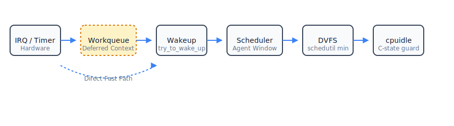

# kernel-dvfs-agentic-latency

**Linux Kernel Slowpath Control Plane for Agentic AI: DVFS, cpuidle, IRQ path, and scheduler wakeups.**

This repository is a systems research project exploring the **Agentic Slowpath Control Plane**. It addresses a fundamental impedance mismatch between modern Linux power/scheduling subsystems and the unique execution patterns of AI agents.

## Thesis
Agentic AI workloads (coding agents, retrieval systems, robotic control loops) run in tight **Wait → Wake → Compute → Repeat** loops. 

Linux subsystems today are **reactive**: they wait for utilization to increase before ramping frequency, and they enter deep sleep states as soon as a task blocks. For an agentic workload with thousands of short steps, this creates **latency amplification**: a massive cumulative delay incurred at every single transition.

## Latency Amplification
Every agent step is gated by a sequence of kernel slowpaths:
1. **IRQ/Timer/Event** completion
2. **Workqueue/kworker** deferred execution
3. **Scheduler** wakeup and task placement
4. **DVFS (schedutil)** frequency ramp-up
5. **cpuidle** C-state exit latency

If each transition takes 100µs and the agent performs 10,000 steps, the kernel introduces **1 full second** of cumulative latency that is completely invisible to traditional "performance tuning."

## Kernel Control Path
Our research proposes an integrated control plane that spans the entire vertical path:

## Patch Series Overview
This RFC implements a cross-subsystem "agent latency window" abstraction:
- **0000**: Core Control Plane (DVFS boosts, cpuidle guards, scheduler wakeup window).
- **0001**: Deferred Completions (Workqueue and Timer latency attribution).
- **0002**: Asynchronous I/O (io_uring and blk-mq attribution).
- **0003**: Memory Subsystem (Page fault and page cache hit/miss tracing).
- **0004**: VFS Metadata (Path lookup, open/stat, and dentry cache attribution).
- **0005**: Enforcement (Cgroup-level latency budgeting and token buckets).

## Observability
We provide a comprehensive suite of eBPF (`bpftrace`) tools to measure:
- Wakeup-to-run latency
- DVFS ramp timing after agent wakeup
- Workqueue execution delay
- Page cache hit/miss ratios in agent loops
- VFS metadata resolution slowpaths

## Latency Budgeting
To prevent mechanism abuse, agent latency behavior is gated by a cgroup token budget. This ensures that latency-sensitive execution remains bounded and does not permanently override power management.

## Status
- **Phase**: Research / RFC (v2)
- **Target**: Linux Kernel (ARM/x86_64)
- **Experimental**: All changes are gated behind `CONFIG_AGENT_LATENCY`.

---
*Note: This is a research artifact. It is not intended for upstream LKML submission in its current form.*
